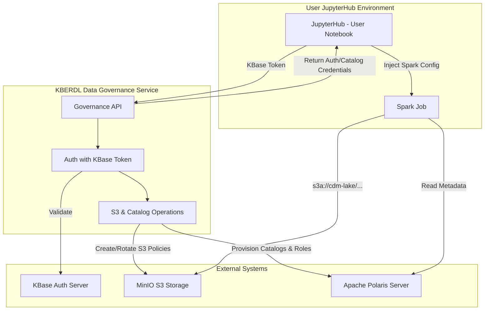

# KBERDL Data Governance Service: High-Level Design & Product Summary

## 1. Overview
The **KBERDL Data Governance Service** (formerly MinIO Manager Service) is a centralized FastAPI-based component that programmatically manages MinIO S3 storage policies and Apache Polaris (Iceberg REST) catalogs to enforce per-user and per-group data governance. Downstream applications—especially Apache Spark jobs running in JupyterHub—will call its RESTful APIs to obtain temporary credentials and enforce access policies **without changing any Spark application code**.

## 2. Objectives
- **Dynamic Credentials**: Issue or rotate per-user MinIO and Polaris credentials on demand, scoped to that user’s isolated storage and catalogs.
- **Policy Enforcement**: Maintain user- and group-level IAM policies in MinIO and RBAC roles in Polaris, automatically updating them as projects evolve.
- **Seamless Integration**: Require zero changes in Spark job code; all credential & catalog wiring happens at runtime via configuration.
- **No Secret Storage**: To maintain security and reduce complexity, the service itself holds only the MinIO and Polaris `root`/admin keys; user secrets are generated and returned transiently.
- **Self-Service UI Access**: Users receive their temporary access key and secret key on JupyterHub and can use them to log in via MinIO’s UI or Polaris/Iceberg tools to browse and manage their own and shared data within their permission scope.

## 3. Key Features
- **User Management**
  - Create/rotate MinIO users and Polaris principals with unique credential pairs.
  - Assign a per-user `home` path (Create if it doesn't exist):  
    ```
    s3a://cdm-lake/users-general-warehouse/{user_name}/  # for general data files (e.g. csv, tsv, etc.)
    s3a://cdm-lake/users-sql-warehouse/{user_name}/      # for Spark SQL/Delta warehouse
    ```
  - Provision a personal isolated Polaris Iceberg catalog (`user_{username}`).
  - Automatically generate and attach policies granting appropriate catalog roles and S3 bucket access.

- **Group/Tenant Management**
  - Create named tenant groups (e.g. `KBase`, `BER`, `CDM_Science`).
  - Create a `home` workspace for each group:  
    ```
    s3a://cdm-lake/groups-general-warehouse/{group_name}/
    ```
  - Provision a shared tenant Polaris Iceberg catalog (`tenant_{group_name}`).
  - Assign users to groups; inherit group MinIO policies and Polaris catalog roles (`{group}_member` vs `{group}ro_member`).

- **Policy & Catalog Lifecycle**
  - **Create**: On new user/group/tenant.
  - **Read**: Inspect current policies and roles for drift detection.
  - **Update**: Add or revoke permissions when share/unshare operations occur.
  - **Delete**: Clean up stale users/groups and policies.

- **Token-Based Auth**
  - Clients authenticate by including their KBase token in the request header—this token is already available from the user’s JupyterHub session.
  - Service validates token via KBase Auth Server, then issues governed keys scoped to the user.

## 4. High-Level Architecture


## 5. Primary API Endpoints (Example-WIP)

| Endpoint                  | Method | Description                                              |
|---------------------------|--------|----------------------------------------------------------|
| `/v1/polaris/user_provision/{user}`| POST | Provision Polaris user environment (catalog, principal, roles, credentials, tenant access). |
| `/credentials/`           | GET    | Get/refresh MinIO user credentials and current policy.   |
| `/users/{user}/share`     | POST   | Grant path-level access between users/groups (Delta).    |
| `/groups/{group}`         | POST   | Create/update group, creating S3 policy & Polaris catalog.|
| `/management/groups/{group}/members/{user}` | POST | Add user to group (grants S3 + Polaris roles). |

## 6. Data & Control Flow

1. **Login from JupyterHub**  
   - JupyterHub requires a KBase token to be set in each user's session.  
   - Endpoints from the Governance Service validate the token via KBase Auth Server.

2. **Credential Issuance (IPython Startup Scripts)**  
   - JupyterHub automatically calls the credential APIs for each user on login (e.g., `01-credentials.py`).  
   - If user doesn’t exist, service creates MinIO user/policy and Polaris principal/catalog.  
   - If exists, service rotates the secret keys and re-evaluates policies/roles.  
   - Returns temporary credential pairs and target catalog aliases (e.g., `POLARIS_PERSONAL_CATALOG`).

3. **Spark Configuration Injection**  
   - Notebook helper code sets the generated credentials into the PySpark session:  
     ```python
     # Legacy Delta configuration
     spark.conf.set("spark.hadoop.fs.s3a.access.key", MINIO_ACCESS_KEY)
     # Polaris configuration injected dynamically
     spark.conf.set("spark.sql.catalog.my.credential", POLARIS_CREDENTIAL)
     spark.conf.set("spark.sql.catalog.my.warehouse", "user_tgu2")
     ```
   - Spark jobs now transparently respect MinIO policies and Polaris ICEBERG limits.

4. **Tenant Sharing / Group Updates**  
   - When an admin adds a user to a group, the Governance Service provisions dual-layer access: Modifies MinIO IAM policies to grant path access, and assigns the Polaris principal to the tenant's catalog roles (Read-Write or Read-Only).
